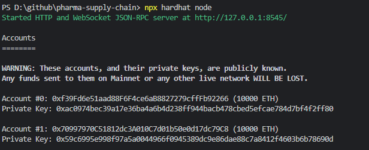
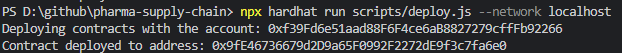
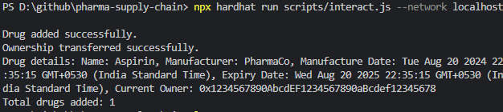

# Pharma Supply Chain

## Description

The Pharma Supply Chain project is a blockchain-based application designed to manage and track pharmaceutical drugs throughout their supply chain. It leverages Ethereum smart contracts to handle the addition of new drugs, transferring drug ownership, and querying drug details.

This project demonstrates the use of Solidity smart contracts along with Hardhat for development and testing on the Ethereum blockchain.

## Features

- **Add Drug**: Register new drugs with details including name, manufacturer, manufacture date, and expiry date.
- **Transfer Ownership**: Change the ownership of a drug.
- **View Drug Details**: Retrieve and display details about a specific drug by its ID.

## Prerequisites

- Node.js (>= 14.x)
- npm (or Yarn)
- Hardhat (for Ethereum development)

## Installation

1. **Clone the repository:**

   ```bash
   git clone https://github.com/your-username/pharma-supply-chain.git
2. **Navigate to the project directory:**

   ```bash
    cd pharma-supply-chain
3. **Install dependencies:**

   ```bash
    npm install
4. **Install Hardhat globally (if not already installed):**

   ```bash
    npm install -g hardhat
## Project Structure

- contracts/: Contains Solidity smart contract files.
- scripts/: Includes deployment and interaction scripts.
- test/: Contains test files for smart contracts.
- hardhat.config.js: Hardhat configuration file.
- package.json: Project metadata and dependencies.
- package-lock.json: Dependency lock file.
- README.md: Project documentation.
  
## Usage

### Running the Local Ethereum Network

- Start a local Hardhat network:

    ```bash
    npx hardhat node
    ```

  
  <br>

### Deploying the Contract

- Deploy the smart contract to the local Hardhat network:

    ```bash
    npx hardhat run scripts/deploy.js --network localhost
    ```

  
  <br>

### Interacting with the Contract

- Interact with the deployed smart contract:

    ```bash
    npx hardhat run scripts/interact.js --network localhost
    ```

  
  <br>
